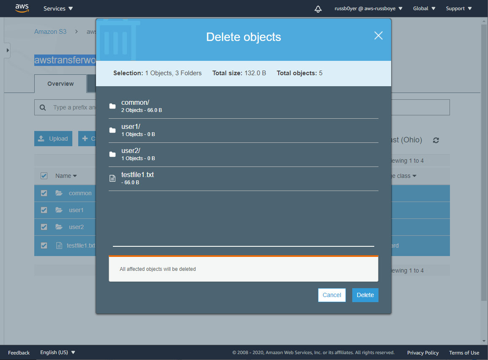
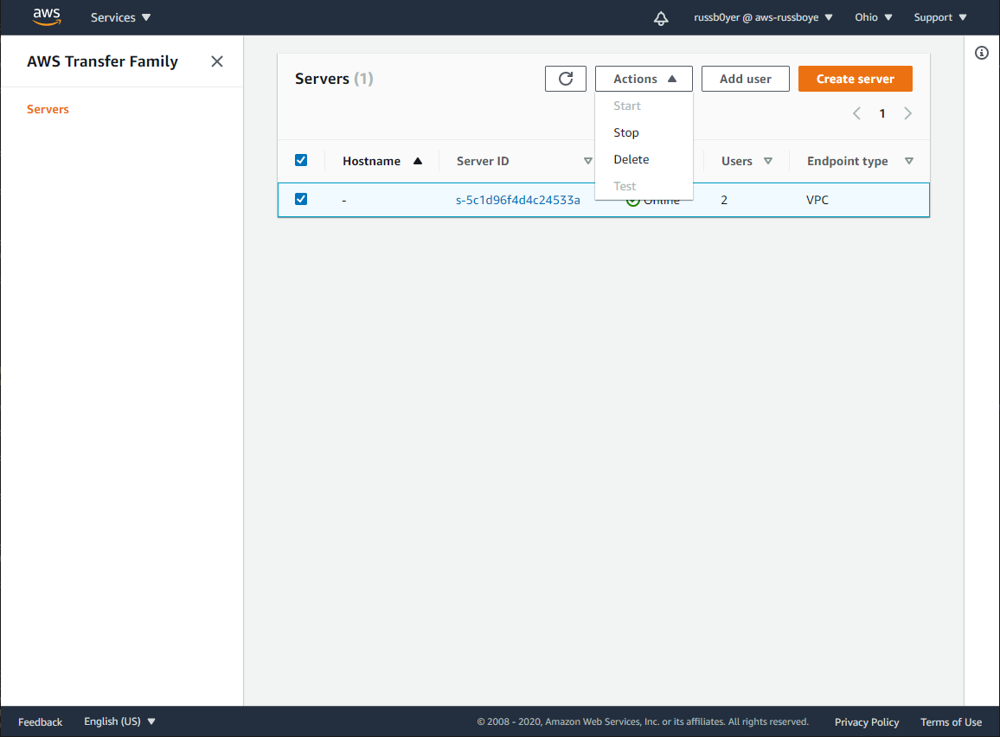
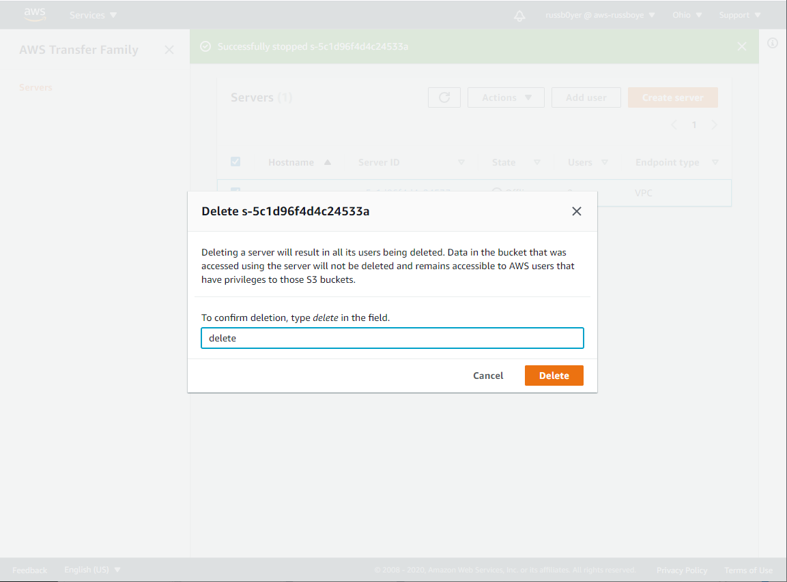
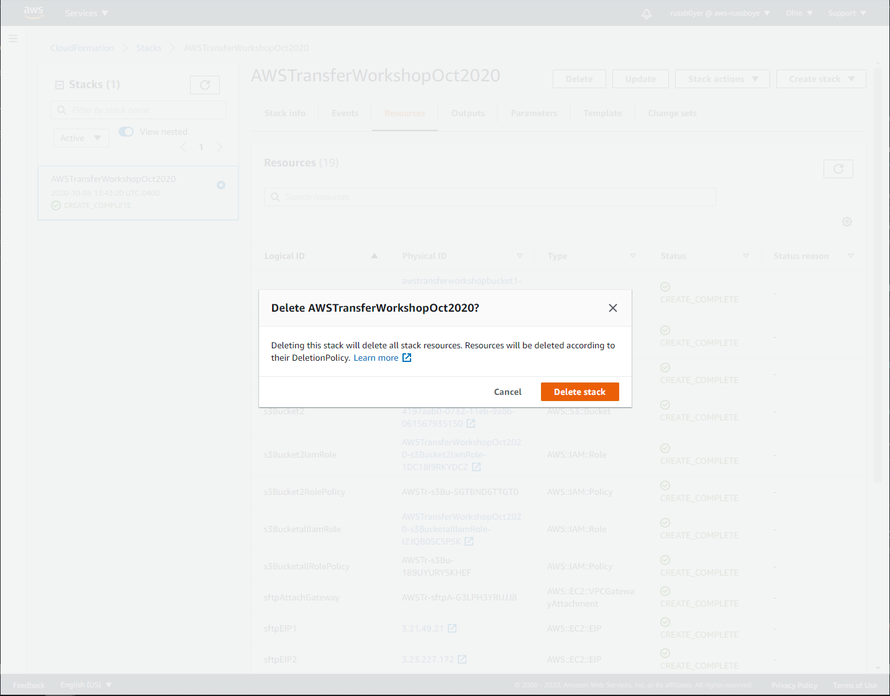

# **AWS Transfer Family**

### Using IP whitelisting and logical directories to secure your AWS Transfer Family servers

© 2022 Amazon Web Services, Inc. and its affiliates. All rights reserved.
This sample code is made available under the MIT-0 license. See the LICENSE file.

Errors or corrections? Contact [olumuyik@amazon.com](mailto:olumuyike@amazon.com).

---

<!--Final rev. for launch Oct 2020-->

# Module 4
## Cleaning up after this workshop

In this module, you will clean up after completing this workshop. Cleaning up is critical, as components of this workshop fall outside of the free tier, and additional charges will accrue if you do not delete the resources created while completing the workshop.

## Module Steps

#### Cleaning Up

The first thing we will clean up is our **Amazon S3** bucket contents. This is a prerequisite step, as we will not be able to delete our buckets until they are empty. From the **Amazon S3** console page, click the name of your first bucket, *awstransferworkshopbucket1* and once in the bucket, check the box to check all objects and folders (next to **Name**). From the **Actions** dropdown, select delete, then choose **Delete**

The next thing we will want to delete is our **AWS Transfer** server itself, but first we will need to stop it. From the **Amazon Transfer Family** console page, check the box next to your server, and from the **Actions** dropdown, choose **Stop**

Once the **AWS Transfer** server is **Offline**, you can check the same box, and from the **Actions** dropdown select Delete, type *delete* to confirm, and choose **Delete**

Additionally, as a last step, you will want to delete the environment you created with your **CloudFormation** template. To do this, return to the console page for **CloudFormation**, and click on your **Stack name**, then choose the **Resources** tab. At the top of the page, choose **Delete**, and on the pop up choose **Delete stack**

The **CloudFormation** created resources will be deleted, and ultimately the **Stack** will no longer be visible in the console. This may require a refresh of the page.

## Module Summary

In this module, we cleaned up after this workshop to ensure no additional charges are incurred.

### Workshop Summary

In this workshop, we showed you how to use **VPC Security Groups** to whitelist access to your **AWS Transfer Family** servers. First we deployed an **AWS CloudFormation template** to configure the needed network elements to configure the sample architecture. Next, we created a new **AWS Transfer server** with an endpoint hosted inside a **VPC**. Then, we demonstrated how to use the **Security Group** associated with that VPC to whitelist access to your server endpoint only to specific IPs, and optionally to peered VPCs inside or outside your account.

Next we used **Logical Directories** to create an organization of different users who all had slightly different access, including one user that had access to folders in multiple **Amazon S3** buckets. 

Using these features, you can limit **AWS Transfer for SFTP** endpoint access to the IPs of your trusted customers and business partners. This adds an additional layer of security, and in addition to the authentication mechanisms supported by **AWS SFTP**, prevents unknown or untrusted entities from even reaching the endpoint. Additionally, a major benefit to hosting the endpoint with two Elastic IPs is that it gives your customers the ability to filter SFTP outbound when their firewalls don’t support URL-based filtering. These benefits can be helpful when working with tightly regulated data such as financial records or Personal Health Information (PHI).

To learn more about **AWS Transfer for SFTP**, check out the following links:

*	[AWS Transfer for SFTP product page](https://aws.amazon.com/sftp/)
*	[AWS Transfer for SFTP documentation](https://docs.aws.amazon.com/transfer/latest/userguide/what-is-aws-transfer-for-sftp.html)

Go to [Workshop Home](/README.md).
